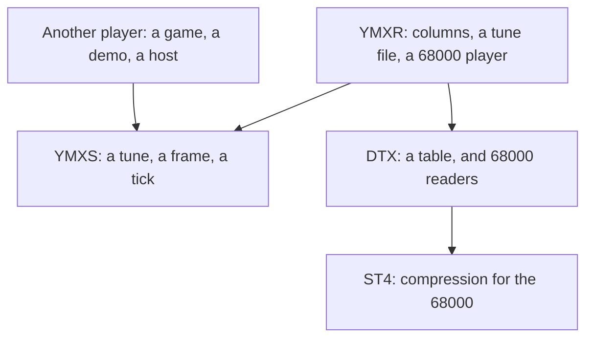
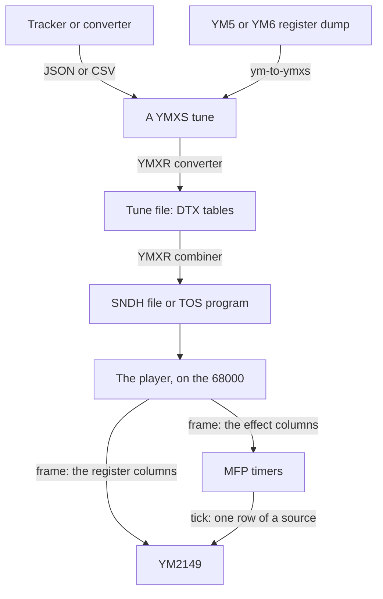

# YMX

## Read this first

**AI wrote most of YMX.** Claude (Anthropic's Claude Code) wrote this
document, and the format, the players and the tools in this repository's
history, under Robbert van Dalen's direction: he requested, read and
merged every change. [LICENSE](LICENSE) is the terms, and its
attribution records who did what. Whether to use software written that
way is the reader's decision, and this section is here so that the
decision is informed.

What it is built on is older than it. The Atari ST chiptune scene comes
first: the musicians and coders who worked out what three voices and a
noise generator could be made to do. Arnaud Carré's YM format and
ST-Sound recorded those tunes. GwEm's maxYMiser is the tracker the scene
writes them in, Steven Tattersall's MinYMiser is the model for the
player, and Einar Saukas's ZX1 is the compressor underneath.

## What YMX is

YMX is a family of four repositories: a specification of a tune, a
player for the Atari ST, and the two formats a tune file is built on.
Each repository defines one thing, and this document defines how they
fit.

This repository is the document. The format, the player and the tools it
used to contain are replaced by
[YMXR](https://github.com/odipar/YMXR); [Where the code
went](#where-the-code-went) names each part and where it is now.

## The four repositories

| repository | what it defines |
|---|---|
| [YMXS](https://github.com/odipar/YMXS) | a tune, and what a player does with one |
| [YMXR](https://github.com/odipar/YMXR) | one encoding of a tune, and a 68000 player that reads it |
| [DTX](https://github.com/odipar/DTX) | a table of rows and columns, and 68000 readers of one |
| [ST4](https://github.com/odipar/ST4) | compression for the 68000 |

An arrow points from a layer to what it rests on. Every player rests on
YMXS for the tune; YMXR rests on DTX as well, for the bytes, and DTX
rests on ST4 for a packed column.

### YMXS

YMXS defines a tune: a rate in frames a second, and a table of rows
where each row sets registers and performs one operation on each of the
four timers. It defines what a frame does with a row, what a tick does
with a source, the range of every register on the YM2149 and the
MC68901, and the rules a writer satisfies. JSON and CSV encode the
structure, so a tracker emits a tune as text.

The layout a player reads is left to that player. YMXR is one such
layout; a second player defines another, and a tune written once plays
under both.

### YMXR

YMXR encodes a YMXS tune as DTX tables and defines what each column
reaches on the two chips. A register is one column. An effect is four:
the target, the source, the control and the count. A tune file has the
tables, an index of the sources and the values fixed for a whole tune.
YMXR also contains the 68000 player, the SNDH core around it and the
program stub in front of that, each assembled once, so combining a tune
into an SNDH file or a TOS program is byte appending and patching.

### DTX

DTX defines a table: `R` rows, `C` columns, every value one width of 1,
2 or 4 bytes, and a row `RR` the table repeats to after the last. Three
variants lay one table out three ways, and DTX2 packs each column as an
ST4 data set. DTX defines the 68000 readers and the calls that reach a
row. The meaning of a column is left to the format built on DTX, which
is why YMXR defines the columns and DTX defines the bytes.

### ST4

ST4 compresses for the plain 68000: four streams rather than one,
lengths and offsets counting units of 1, 2 or 4 bytes, and decoders
small enough to include with a player. It derives from Einar Saukas's
ZX1 through ST1. A DTX2 column is packed with it, and a format above DTX
reaches it through DTX.

## How a tune reaches the chips

Two clocks run a tune. The host calls the player once a frame, at the
tune's rate: the player reads one row, writes the effect columns to the
timers and the register columns to the sound chip. Each timer an effect
uses raises a tick at the effect's rate: the player reads one row of the
source connected to that timer and writes it through the target, a
register of the sound chip. A SID voice, a sync buzzer and a sample are
each a source on a timer, at rates above the frame rate. Sections 4 and
5 of [the YMXS specification](https://github.com/odipar/YMXS/blob/main/doc/SPEC.md)
define both procedures.

## Building another player

YMXR is the player of this family. A second player reads the same
tunes, `ymxs-check` reports the same errors in them, and a tracker that
emits YMXS JSON reaches every player at once.

A player defines the layout it reads, and YMXS section 8 lists what else
it settles: the registers of the MC68901 a timer operation writes, the
timing of a tick within a frame, and how a write of R7 obtains the two
bits the host owns. YMXR settles each of those, and a second player
settles them again; the tune is the same under both, and the two differ
in what a file contains and what a frame costs.

**A player for a game.** YMXR reads one row a frame and writes every
column that row sets. A game plays sound effects on the same three
voices, so while an effect runs, the effect reaches that voice and the
tune reaches the other two. A player for a game selects, voice by voice,
which of the two reaches the chip, and that selection is outside YMXS at
version 3: the structure defines one tune reaching the chip (1.2).

Two parts of that are defined already. The host owns the timers outside
the tune's (1.10), so a tune using two timers leaves two for the
effects. A sound effect is a source on one of those timers, or a second
tune in the same structure, written by the same tracker and checked by
the same tool. The selection is left to define: which voice the tune
reaches while an effect runs, and what that voice returns to when the
effect ends.

**A player on a machine with the RAM for a tune.** DTX and ST4 are in
this family because a tune larger than the RAM has to stream. A player
with the RAM for the tune skips both: it reads the JSON, or a layout it
defines, and performs sections 4 and 5. The frame and the tick are the
same procedures, and a table is a list in memory rather than a packed
column.

## Where the code went

Up to commit `0cab58a` this repository contained the YMX format, its
specification, the 68000 player, the SNDH core, the packer and the
combiners in Java, C# and Go, and the emulation rigs. The tags
`binaries-v0.4.1` to `binaries-v0.10.1` reach the releases built from
it, and `git log` reaches the sources. Every part is replaced:

| what was here | where it is now |
|---|---|
| `doc/SPEC.md`, the format | YMXR, `doc/SPEC.md`, over DTX tables |
| `doc/BINARIES.md`, the binary layouts | YMXR, `doc/BINARIES.md` |
| `68k/YMX.S`, the player | YMXR, `68k/YMXR.S` |
| `68k/ST4*.S`, the stream decoders | DTX, `68k/`, under DTX's reader |
| `org.ymx.Tune`, the tune a front end produces | YMXS, the structure |
| `org.ym6`, the YM reader | YMXS, `ym-to-ymxs` |
| `org.st4`, the compressor | ST4, copied into DTX |
| `doc/experiments.md`, `doc/performance.md` | YMXR, under the same names |
| `doc/conformance/`, the kit | YMXR, `doc/conformance/` |

A tune packed by the old tools reaches the new player through YMXR
0.3.12, the last release that reads a `.ymx` file. Releases after it
convert a YM dump or a YMXS tune alone.

YMX began as the `.yx6` container from
[ST4](https://github.com/odipar/ST4), adopted whole and renumbered. ST4
goes on being developed there.

## License and attribution

The YMX name and this document are © 2026 Robbert van Dalen. Claude
(Anthropic's Claude Code) wrote the document, and the format, the
players and the tools in this repository's history, under Robbert's
direction.

Each format is licensed where it is defined: YMXS, YMXR, DTX and ST4
each have a LICENSE. [LICENSE](LICENSE) here covers this document and
the history behind it.

The YM5 and YM6 register-dump formats are by Arnaud Carré
(Leonard/Oxygene). ST4 derives from
[ZX1](https://github.com/einar-saukas/ZX1) by Einar Saukas through
[ST1](https://github.com/odipar/ST1). The player was inspired by Steven
Tattersall's MinYMiser. SNDH is the Atari ST scene's shared music
container. Grazey's long work put the ST chiptunes in the open and keeps
them there.

Special thanks to Sandor Drieënhuizen and Wietze Spijkerman for their
support, proofreading and ideas.

[AGENTS.md](AGENTS.md) is the house style this document follows.
